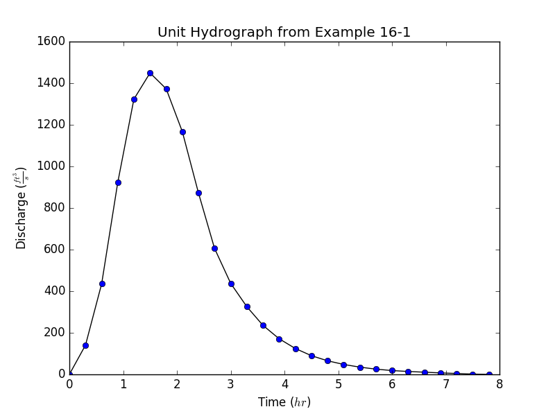
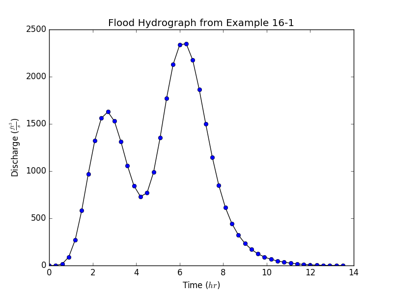

# Project Overview

PyFlo is an open-source library written in Python for performing hydraulic and hydrology stormwater 
analysis. Capabilities include network hydraulic grade analysis and time/iteration based storage and 
flood routing simulations. SCS Unit Hydrograph and Rational Method are included for basin 
computations. Most of the calculations and procedures are derived from available existing 
publications and resources. There are some GUI programs available that have similar capabilities. 
The intent is that many will build from and contribute to the project, making it much more powerful 
than a single person ever could.

# Installation

Installing the easy way, using pip:

```bash
$ pip install pyflo
```

# Examples

## Hydrographs

From [NEH Hydrology Ch. 16, Ex. 16-1](http://www.wcc.nrcs.usda.gov/ftpref/wntsc/H&H/NEHhydrology/ch16.pdf#page=15):

```python
from pyflo import system
from pyflo.nrcs import hydrology

uh484 = system.array_from_csv('./resources/distributions/runoff/scs484.csv')
basin = hydrology.Basin(
    area=4.6,
    cn=85.0,
    tc=2.3,
    runoff_dist=uh484,
    peak_factor=484.0
)
```
### Unit Hydrograph

With PyFlo, it's fairly simple to create a unit hydrograph, which represents the time-flow 
relationship per unit (inch) of runoff depth.

```python
unit_hydrograph = basin.unit_hydrograph(interval=0.3)
```

We can use `matplotlib` to plot the example results:

```python
from matplotlib import pyplot

x = unit_hydrograph[:, 0]
y = unit_hydrograph[:, 1]
pyplot.plot(x, y, 'k')
pyplot.plot(x, y, 'bo')
pyplot.title(r'Unit Hydrograph from Example 16-1')
pyplot.xlabel(r'Time ($hr$)')
pyplot.ylabel(r'Discharge ($\frac{ft^{3}}{s}$)')
pyplot.show()
```



### Flood Hydrograph

A flood hydrograph can be generated, which is a time-flow relationship synthesized from basin 
properties and a provided scaled rainfall distribution.

```python
import numpy

rainfall_dist = numpy.array([
    (0.00, 0.000),
    (0.05, 0.074),
    (0.10, 0.174),
    (0.15, 0.280),
    (0.20, 0.378),
    (0.25, 0.448),
    (0.30, 0.496),
    (0.35, 0.526),
    (0.40, 0.540),
    (0.45, 0.540),
    (0.50, 0.540),
    (0.55, 0.542),
    (0.60, 0.554),
    (0.65, 0.582),
    (0.70, 0.640),
    (0.75, 0.724),
    (0.80, 0.816),
    (0.85, 0.886),
    (0.90, 0.940),
    (0.95, 0.980),
    (1.00, 1.000)
])
rainfall_depths = rainfall_dist * [6.0, 5.0]  # Scale array to 5 inches over 6 hours.
flood_hydrograph = basin.flood_hydrograph(rainfall_depths, interval=0.3)
```

We can use `matplotlib` to plot the example results:

```python
from matplotlib import pyplot

x = flood_hydrograph[:, 0]
y = flood_hydrograph[:, 1]
pyplot.plot(x, y, 'k')
pyplot.plot(x, y, 'bo')
pyplot.title(r'Flood Hydrograph from Example 16-1')
pyplot.xlabel(r'Time ($hr$)')
pyplot.ylabel(r'Discharge ($\frac{ft^{3}}{s}$)')
pyplot.show()
```



# Contributing

For developers, it's important to use common best practices when contributing to the project.
[PEP 8](https://www.python.org/dev/peps/pep-0008/) should always be adhered. Code should be
documented with [Google style docstrings](http://sphinxcontrib-napoleon.readthedocs.io/en/latest/example_google.html).
Pull requests and filing issues are encouraged.

To start contributing with the PyFlo repository:

1. Fork it!

2. Create a local clone of your fork.
    
        $ git clone https://github.com/YOUR-USERNAME/pyflo
        Cloning into `pyflo`...
        remote: Counting objects: 10, done.
        remote: Compressing objects: 100% (8/8), done.
        remove: Total 10 (delta 1), reused 10 (delta 1)
        Unpacking objects: 100% (10/10), done.

3. Set up a clean working environment, using virtualenv.

        $ virtualenv -p python3 venv
        $ source venv/bin/activate
        $ pip install -r requirements/development.txt

4. Add the original as a remote repository named `upstream`.

        $ git remote add upstream https://github.com/benjiyamin/pyflo.git
        $ git remote -v
        origin    https://github.com/YOUR-USERNAME/pyflo.git (fetch)
        origin    https://github.com/YOUR-USERNAME/pyflo.git (push)
        upstream  https://github.com/benjiyamin/pyflo.git (fetch)
        upstream  https://github.com/benjiyamin/pyflo.git (push)

5. Fetch the current upstream repository branches and commits.

        $ git fetch upstream
        remote: Counting objects: 75, done.
        remote: Compressing objects: 100% (53/53), done.
        remote: Total 62 (delta 27), reused 44 (delta 9)
        Unpacking objects: 100% (62/62), done.
        From https://github.com/benjiyamin/pyflo
         * [new branch]      master     -> upstream/master

6. Checkout your local `master` branch and sync `upstream/master` to it, without losing local changes.

        $ git checkout master
        Switched to branch 'master'
        
        $ git merge upstream/master

7. Commit your local changes and push to `upstream/master`.

        $ git commit -m 'Add some feature'
        $ git push upstream master

8. Submit a pull request. =)

For a list of contributors who have participated in this project, check out [AUTHORS](AUTHORS.md).

# Testing

Unit Testing is currently done using the built-in unittest module:

```bash
$ python tests.py
```

# License

This project is licensed under GPL 3.0 - see [LICENSE](LICENSE.md) for details.
