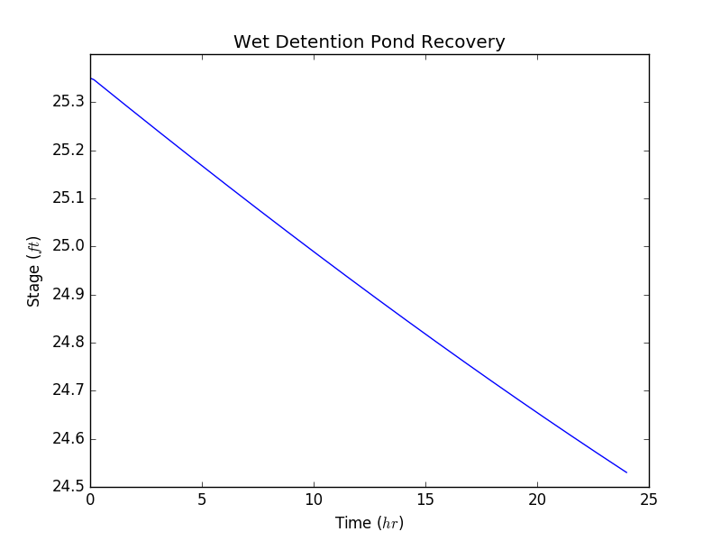

# Hydrographs

From [NEH Hydrology Ch. 16, Ex. 16-1](http://www.wcc.nrcs.usda.gov/ftpref/wntsc/H&H/NEHhydrology/ch16.pdf#page=15):

```python
from pyflo import system
from pyflo.nrcs import hydrology

uh484 = system.array_from_csv('./resources/distributions/runoff/scs484.csv')
basin = hydrology.Basin(
    area=4.6,
    cn=85.0,
    tc=2.3,
    runoff_dist=uh484,
    peak_factor=484.0
)
```
## Unit Hydrograph

With PyFlo, it's fairly simple to create a unit hydrograph, which represents the time-flow 
relationship per unit (inch) of runoff depth.

```python
unit_hydrograph = basin.unit_hydrograph(interval=0.3)
```

We can use `matplotlib` to plot the example results:

```python
from matplotlib import pyplot

x = unit_hydrograph[:, 0]
y = unit_hydrograph[:, 1]
pyplot.plot(x, y, 'k')
pyplot.plot(x, y, 'bo')
pyplot.title(r'Unit Hydrograph from Example 16-1')
pyplot.xlabel(r'Time ($hr$)')
pyplot.ylabel(r'Discharge ($\frac{ft^{3}}{s}$)')
pyplot.show()
```


## Flood Hydrograph

A flood hydrograph can be generated, which is a time-flow relationship synthesized from basin 
properties and a provided scaled rainfall distribution.

```python
import numpy

rainfall_dist = numpy.array([
    (0.00, 0.000),
    (0.05, 0.074),
    (0.10, 0.174),
    (0.15, 0.280),
    (0.20, 0.378),
    (0.25, 0.448),
    (0.30, 0.496),
    (0.35, 0.526),
    (0.40, 0.540),
    (0.45, 0.540),
    (0.50, 0.540),
    (0.55, 0.542),
    (0.60, 0.554),
    (0.65, 0.582),
    (0.70, 0.640),
    (0.75, 0.724),
    (0.80, 0.816),
    (0.85, 0.886),
    (0.90, 0.940),
    (0.95, 0.980),
    (1.00, 1.000)
])
rainfall_depths = rainfall_dist * [6.0, 5.0]  # Scale array to 5 inches over 6 hours.
flood_hydrograph = basin.flood_hydrograph(rainfall_depths, interval=0.3)
```

We can use `matplotlib` to plot the example results:

```python
from matplotlib import pyplot

x = flood_hydrograph[:, 0]
y = flood_hydrograph[:, 1]
pyplot.plot(x, y, 'k')
pyplot.plot(x, y, 'bo')
pyplot.title(r'Flood Hydrograph from Example 16-1')
pyplot.xlabel(r'Time ($hr$)')
pyplot.ylabel(r'Discharge ($\frac{ft^{3}}{s}$)')
pyplot.show()
```


# Reservoirs

## Orifice Recovery

A wet detention pond has the following geometry:

| Elevation (ft) | Area (ft<sup>3</sup>) |
| -------------- | --------------------- |
| 16.0           | 4356.0                |
| 21.5           | 18295.2               |
| 23.5           | 26571.6               |
| 29.8           | 24450.0               |

Right after a storm, the stage of the pond is at elevation 25.35 ft. The orifice that will gradually 
release the stormwater at a controlled rate is at invert elevation 23.35 and is 3.25 inches in 
diameter. The orifice coefficient is assumed to be 0.6.

Produce the time-stage relationship of the pond over the next 24 hours.

```python
from pyflo import networks, routing, sections

network = networks.Network()
n_1 = network.create_node()
out = network.create_node()
contours = [
    (16.0, 4356.0),
    (21.5, 18295.2),
    (23.5, 26571.6),
    (29.8, 54450.0)
]
pond = routing.Reservoir(contours=contours, start_stage=25.35)
n_1.add_reservoir(reservoir=pond)
dia = 3.25 / 12.0  # 3.25 inches, converted to feet
cir = sections.Circle(diameter=dia)
n_1.create_weir(node_2=out, invert=23.5, k_orif=0.6, k_weir=3.2, section=cir)
interval = 10.0 / 60.0  # 10 minutes, converted to hours
analysis = routing.Analysis(node=out, tw=0.0, duration=24.0, interval=interval)
results = analysis.node_solution_results()
```

We can use `matplotlib` to plot the example results:

```python
from matplotlib import pyplot

data = results[0]['data']
x_recovery = [line['time'] for line in data]
y_recovery = [line['stage'] for line in data]
pyplot.plot(x_recovery, y_recovery, 'b')
pyplot.title(r'Wet Detention Pond Recovery')
pyplot.xlabel(r'Time ($hr$)')
pyplot.ylabel(r'Stage ($ft$)')
pyplot.show()

```


